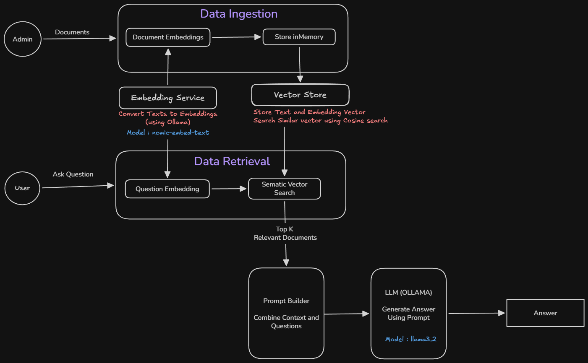

# Local RAG from Scratch (TypeScript + Ollama)

A Retrieval-Augmented Generation (RAG) implementation built **from scratch** in **TypeScript**, without using LangChain, ChromaDB, or any vector database.

The goal of this project is to understand **how RAG actually works** before relying on frameworks.

## Features

- Generate **embeddings** using Ollama
- Build an in-memory **vector** store
- Implement **cosine similarity** from scratch
- Perform **semantic search** over documents
- Generate answers using a **local LLM**

## Architecture



- TypeScript
- Node.js
- Ollama
- Llama 3.2 (Chat Model)
- nomic-embed-text (Embedding Model)

### Prerequiste

1. Download and install Ollama from: https://ollama.com/download
2. Pull Local LLMs

```bash
ollama pull llama3.2
ollama pull nomic-embed-text
```

3. Verify the models are available: `bash
ollama list
`

### Getting Started

1. Add Context and Questions in `src\config.ts`
2. Run `npm install` to install deps.
3. Run `npm run start` to run the RAG service.
